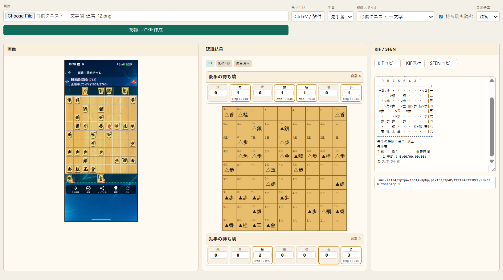

# 将棋画像KIF変換・画像認識ツール / Shogi Image KIF Converter

将棋クエスト、ぴよ将棋の一文字駒スクリーンショットを画像認識し、将棋の局面をKIF / SFEN / JSONへ変換するWindows向けの非公式ツールです。ブラウザで使えるHTML UIから画像を選択し、盤面と持ち駒を目視確認してからKIFをコピーできます。

将棋アプリの対局画面を棋譜管理ソフトや将棋アプリに移したいとき、スクリーンショットから局面KIFを作りたいとき、SFEN形式で局面を保存したいときに使えます。

Project page: https://saka996.github.io/shogi-quest-image-kif-converter/

※ URLには、このツールが将棋クエスト向けとして始まった時点の名前が残っています。

## 画面イメージ



左に元画像、中央に認識結果、右にKIF/SFENが表示されます。盤面のマスや持ち駒をクリックすると、元画像のどの位置と対応しているか確認できます。

## スクリーンショットをKIF/SFENへ変換する手順（HTML UI）

将棋クエストまたはぴよ将棋の一文字駒スクリーンショットを、ブラウザ画面で確認しながらKIF/SFENに変換する手順です。Windowsでは `start_kif_ui.cmd` をダブルクリックして使います。

### 最初の準備（1回だけ）

1. GitHubのページで、緑色の `Code` ボタンを押します。
2. `Download ZIP` を押して、ZIPファイルをダウンロードします。
3. ダウンロードしたZIPを右クリックして、`すべて展開` を押します。
4. 展開したフォルダを開きます。`start_kif_ui.cmd` が見えていれば、その場所で合っています。
5. フォルダの何もないところで右クリックし、`ターミナルで開く` または `PowerShellで開く` を押します。
6. 開いた黒い画面、または青い画面に次のコマンドを貼り付けて、Enterを押します。

```powershell
py -m pip install -e .
```

ここまで終われば、次回からはこのコマンドを実行する必要はありません。

将棋クエスト一文字駒向けの学習済みモデルは `models\shogi_quest_ichimonji_piece_model.pkl`、ぴよ将棋一文字駒向けの学習済みモデルは `models\piyo_ichimonji_piece_model.pkl` として同梱済みです。通常は別途モデルを用意する必要はありません。

### 毎回の使い方

1. `start_kif_ui.cmd` をダブルクリックします。
2. ブラウザが開いたら、`画像を選択` からスクリーンショットを選びます。
3. クリップボードに画像がある場合は、画面上で `Ctrl+V` でも貼り付けできます。
4. `認識スタイル` で、画像に合わせて `将棋クエスト 一文字` または `ぴよ将棋 一文字` を選びます。
5. 盤面、先手の持ち駒、後手の持ち駒を元画像と見比べます。
6. 問題なければ、KIFまたはSFENをコピーします。

### 終了するとき

1. ブラウザのタブを閉じます。
2. `start_kif_ui.cmd` で開いた黒い画面をクリックします。
3. `Ctrl+C` を押します。
4. `バッチ ジョブを終了しますか (Y/N)?` と表示されたら、`Y` を押してEnterを押します。

ブラウザを閉じるだけでは、画像解析用のローカルサーバーは止まりません。よく分からない場合は、`start_kif_ui.cmd` で開いた黒い画面の右上の `×` を押して閉じても大丈夫です。

`start_kif_ui.cmd` を実行して `not recognized as an internal or external command` のようなエラーが出る場合は、古い起動ファイルを使っている可能性があります。GitHubから最新版をダウンロードし直してください。

## 対象

別ユーザーが簡単に使うためのHTML画像解析UIは、現時点では次の範囲を主対象にしています。

- 対応したのは「将棋クエスト」と「ぴよ将棋」の一文字駒スクリーンショットです。
- スマホでスクリーンショットを撮影した画像のみを対象にしています。
- 確認済みの機種は Pixel 7a のみです。

他端末、別アプリ、別テーマ、トリミング済み画像でも試すことはできますが、公開時点の保証対象ではありません。KIF/SFENを他アプリへ渡す前に、盤面と持ち駒をUI上で目視確認してください。

## インストール

```powershell
pip install .
```

ShogiVision連携を試す場合だけ、重い推論依存を追加します。

```powershell
pip install ".[shogivision]"
```

開発中にインストールせず実行する場合は、`PYTHONPATH`に`src`を通します。

```powershell
$env:PYTHONPATH = "src"
python -m shogi_gazo_desktop.cli --help
```

## HTML画像解析UIを使う

Windowsでは、リポジトリ直下の `start_kif_ui.cmd` をダブルクリックすると、ローカルサーバーを起動してブラウザでHTML UIを開きます。

```powershell
.\start_kif_ui.cmd
```

ブラウザが開いたら、一文字駒のスマホスクリーンショットを選択するか、クリップボードにコピーされた画像を `Ctrl+V` で貼り付けます。認識スタイルは既定で `将棋クエスト 一文字` です。ぴよ将棋の画像では `ぴよ将棋 一文字` を選ぶと、専用モデルに自動で切り替わります。

終了するときは、ブラウザのタブを閉じたあと、`start_kif_ui.cmd` で開いた黒い画面で `Ctrl+C` を押します。確認が出たら `Y` を押してEnterを押してください。黒い画面の右上の `×` で閉じても止められます。

UIでは次を確認できます。

- 元画像と認識結果の盤面を横に並べて確認
- 先手の持ち駒と後手の持ち駒を盤面の上下に表示
- マスや持ち駒をクリックして、元画像のどの位置と対応しているか確認
- KIF/SFENをコピーまたはダウンロード

初回だけPython環境が必要です。将棋クエスト一文字駒向けのモデルと学習用画像、ぴよ将棋一文字駒向けのモデルを同梱しています。ぴよ将棋モデルを再作成する場合は、ローカルにあるぴよ将棋一文字駒のスクリーンショットが必要です。別アプリや別スタイル向けに作り直す場合は、下の「モデルを用意する」のコマンドで別モデルを作成できます。

詳しい手順は [docs/HTML_UI_USAGE_JA.md](docs/HTML_UI_USAGE_JA.md) を参照してください。

### HTML UIで困ったとき

- `models\shogi_quest_ichimonji_piece_model.pkl` または `models\piyo_ichimonji_piece_model.pkl` が見つからない場合は、リポジトリを最新化するか、下の「モデルを用意する」の手順で作り直してください。
- ブラウザが自動で開かない場合は、`start_kif_ui.cmd` の画面を開いたまま `http://127.0.0.1:8765/` をブラウザで開いてください。
- KIFを他アプリへ貼り付けてエラーになる場合は、まずUI上で盤面、先手持ち駒、後手持ち駒、手番が正しいか確認してください。取り込み先アプリによってはSFENの方が通りやすい場合があります。
- 対象外の画像、低解像度、トリミング済み、別端末のスクリーンショットでは誤認識することがあります。

## CLI

インストール後は`shogi-gazo`コマンドを使います。

```powershell
shogi-gazo --help
```

### モデルを用意する

将棋クエスト一文字駒向けには `models\shogi_quest_ichimonji_piece_model.pkl`、ぴよ将棋一文字駒向けには `models\piyo_ichimonji_piece_model.pkl` を同梱しています。HTML UIは認識スタイルに合わせてこの2つを自動選択します。

別アプリ、別スタイル、別端末向けに認識したい場合は、別途入手したモデルを `--model` で指定するか、ラベル付きサンプルからモデルを作ります。

```powershell
shogi-gazo train-model --screenshots-dir path\to\screenshots --labels path\to\labels --out models\piece_model.pkl --include-hands
```

同梱している将棋クエスト一文字駒の画像とラベルだけでモデルを作り直す場合は、次のように実行します。

```powershell
shogi-gazo train-model --screenshots-dir data\samples\screenshots_by_app_piece_style\将棋クエスト\一文字駒 --labels data\samples\labels\boards_by_app_piece_style\将棋クエスト\一文字駒 --out models\shogi_quest_ichimonji_piece_model.pkl --include-hands
```

ぴよ将棋一文字駒の専用モデルを作り直す場合は、手元のローカル画像とラベルを使って次のように実行します。

```powershell
shogi-gazo train-model --screenshots-dir data\samples\screenshots_by_app_piece_style\ぴよ将棋\一文字駒 --labels data\samples\labels\boards_by_app_piece_style\ぴよ将棋\一文字駒 --out models\piyo_ichimonji_piece_model.pkl --include-hands
```

### 1枚を認識する

```powershell
shogi-gazo recognize path\to\screenshot.png --model models\shogi_quest_ichimonji_piece_model.pkl --out outputs\sample_run --include-hands
```

ぴよ将棋一文字駒の画像をCLIで認識する場合は、`--model models\piyo_ichimonji_piece_model.pkl` を指定します。結果JSONのパスと`needs_review`が出力されます。出力先は`outputs\sample_run\<画像名>\recognition.json`で、HTMLレビュー用に同じフォルダへ`piece_report.json`も保存します。未知セルや低信頼の候補が残る場合は、終了コード`3`で要確認を示します。

### ディレクトリを一括認識する

```powershell
shogi-gazo batch path\to\screenshots --model models\piece_model.pkl --out outputs\batch_run --include-hands
```

入力配下の`.png`、`.jpg`、`.jpeg`、`.webp`を再帰的に処理し、`manifest.json`を出力します。
改善中の代表サンプルだけを処理したい場合は、`--sample <画像名の拡張子なし>`を複数指定できます。重いno-leak検証では`--limit`も使えます。

```powershell
shogi-gazo batch data\samples\screenshots_by_app_piece_style --out outputs\noleak_probe --include-hands --no-leak --sample 将棋クエスト_一文字駒_通常_01 --sample 将棋クエスト_一文字駒_通常_02
```

### 認識結果をexportする

```powershell
shogi-gazo export outputs\sample_run\<画像名>\recognition.json --format kif --side-to-move black --out outputs\sample.kif
shogi-gazo export outputs\sample_run\<画像名>\recognition.json --format sfen --side-to-move black
shogi-gazo export outputs\sample_run\<画像名>\recognition.json --format json --out outputs\sample.normalized.json
```

KIF出力は局面KIF/BODです。1枚のスクリーンショットから指し手履歴を復元するものではありません。
未知セル、二歩、駒数超過、玉数不整合、未解決の盤面制約が残る場合は、誤った局面ファイルを避けるためexportを失敗させます。

### HTMLレビューを作る

```powershell
shogi-gazo review outputs\batch_run --labels data\samples\labels\boards_by_app_piece_style --html outputs\batch_run\visual_review.html --include-hands
```

認識結果、低信頼セル、ラベルとの比較を目視確認するためのHTMLを生成します。

### 評価セットで検証する

```powershell
shogi-gazo evaluate outputs\batch_run --labels data\samples\labels\boards_by_app_piece_style --include-hands --require-perfect
```

`--require-perfect` は、盤上駒、持ち駒、高信頼エラー、リーク検出がすべて0でない限り非ゼロ終了します。同梱モデルやラベルを更新するときの回帰確認はこのgateで管理します。
評価JSONには全体metricsだけでなく、サンプル別のエラー詳細も保存されます。調査中は`--sample`と`--limit`で対象を絞れます。

学習に使った同じ画像を評価する closed-set では、ラベル付きサンプルに対する完全一致を確認します。未知画像への汎化確認には、`batch --no-leak` と `evaluate --strict-leak-guard` を使います。公開UIの主な確認範囲は、将棋クエスト / ぴよ将棋の一文字駒スクリーンショットを同梱モデルで認識し、UI上で目視確認して使う範囲です。未解決制約やunknownが残る局面はexportで止め、人間のレビュー対象にします。

### ラベルを検証する

```powershell
shogi-gazo validate-labels --labels data\samples\labels\boards_by_app_piece_style
```

ラベルJSONの形式と駒数インベントリを検証します。問題がある場合は終了コード`4`になります。

## 開発実行例

ローカル作業中は次のように`PYTHONPATH`を指定して、インストール前のソースを直接実行できます。

```powershell
$env:PYTHONPATH = "src"
python -m shogi_gazo_desktop.cli train-model --screenshots-dir data\samples\screenshots_by_app_piece_style --labels data\samples\labels\boards_by_app_piece_style --out outputs\models\piece_model.pkl --include-hands
python -m shogi_gazo_desktop.cli recognize data\samples\screenshots_by_app_piece_style\将棋クエスト\一文字駒\将棋クエスト_一文字駒_通常_01.png --model models\shogi_quest_ichimonji_piece_model.pkl --out outputs\dev_sample --include-hands
python -m shogi_gazo_desktop.cli batch data\samples\screenshots_by_app_piece_style --out outputs\dev_batch --include-hands
python -m shogi_gazo_desktop.cli batch data\samples\screenshots_by_app_piece_style --out outputs\dev_noleak --include-hands --no-leak
python -m shogi_gazo_desktop.cli export outputs\dev_sample\<画像名>\recognition.json --format kif --out outputs\dev_sample.kif
python -m shogi_gazo_desktop.cli review outputs\dev_batch --labels data\samples\labels\boards_by_app_piece_style --include-hands
python -m shogi_gazo_desktop.cli evaluate outputs\dev_batch --labels data\samples\labels\boards_by_app_piece_style --include-hands --require-perfect
python -m shogi_gazo_desktop.cli evaluate outputs\dev_noleak --labels data\samples\labels\boards_by_app_piece_style --include-hands --strict-leak-guard
python -m shogi_gazo_desktop.cli validate-labels --labels data\samples\labels\boards_by_app_piece_style
python -m shogi_gazo_desktop.cli kif-ui --host 127.0.0.1 --port 8765 --out outputs\kif_ui
```

## 公開対象と除外物

公開リポジトリには、CLI本体、ドキュメント、テスト、将棋クエスト一文字駒の学習用画像とラベル、ぴよ将棋一文字駒のラベル、将棋クエスト / ぴよ将棋一文字駒の学習済みモデルを含めます。ぴよ将棋一文字駒のスクリーンショット画像は公開配布には含めず、再学習する場合は手元のローカル画像を使います。

次のディレクトリはローカル評価・調査用であり、公開配布から除外します。ただし `data/samples/screenshots_by_app_piece_style/将棋クエスト/一文字駒/`、`models/shogi_quest_ichimonji_piece_model.pkl`、`models/piyo_ichimonji_piece_model.pkl` はHTML UI用に公開対象です。

- `data/samples/screenshots_by_app_piece_style/`
- `reports/`
- `outputs/`
- `third_party/ShogiVision/`

ShogiVisionは将来的な任意連携候補です。v1の必須依存ではなく、同梱もしません。

## 注意

- 認識結果に`needs_review`が立つ場合、その局面は人間の確認を前提にしてください。
- 未知セルが残る局面、駒数が不整合な局面、対象外UIのスクリーンショットはexportできない場合があります。
- KIFは局面の保存用です。通常の棋譜のような指し手履歴は生成しません。
- コードはMIT Licenseです。同梱しているサンプル画像、各アプリの画面、駒・盤面などの表示素材に関する権利は各権利者に帰属します。機能確認用の最小データと学習済みモデルとして同梱しています。

## テスト

```powershell
pip install -e ".[dev]"
python -m py_compile src\shogi_gazo_desktop\cli.py src\shogi_gazo_desktop\recognition.py src\shogi_gazo_desktop\export.py
python -m pytest tests
```

# English Version

`Shogi Image KIF Converter` is an unofficial Windows-friendly Python tool that recognizes a shogi position from a Shogi Quest or Piyo Shogi one-character-piece screenshot and exports the result as JSON, SFEN, or KIF.

The easiest way to use it is the local HTML UI. You select or paste a screenshot, compare the recognized board and captured pieces with the original image, then copy KIF or SFEN.

Project page: https://saka996.github.io/shogi-quest-image-kif-converter/

The project page URL keeps the original Shogi Quest project slug, but the tool now also includes a bundled Piyo Shogi one-character model.

## Quick Start For The HTML UI

This bundled HTML UI is currently intended for Shogi Quest and Piyo Shogi screenshots using the one-character piece style.

### First-Time Setup

1. On the GitHub page, click the green `Code` button.
2. Click `Download ZIP`.
3. Right-click the downloaded ZIP file and choose `Extract All`.
4. Open the extracted folder. You are in the right place if you can see `start_kif_ui.cmd`.
5. Right-click an empty area in that folder and choose `Open in Terminal` or `Open in PowerShell`.
6. Paste the following command and press Enter.

```powershell
py -m pip install -e .
```

You only need to run this command once.

The trained models for one-character pieces are included at `models\shogi_quest_ichimonji_piece_model.pkl` and `models\piyo_ichimonji_piece_model.pkl`, so you normally do not need to prepare a separate model.

### Everyday Use

1. Double-click `start_kif_ui.cmd`.
2. When the browser opens, click `画像を選択` and choose a screenshot.
3. If an image is already in your clipboard, you can also paste it with `Ctrl+V`.
4. Choose `将棋クエスト 一文字` or `ぴよ将棋 一文字` in `認識スタイル` to match the screenshot.
5. Compare the board, sente captured pieces, and gote captured pieces with the original image.
6. If everything looks correct, copy KIF or SFEN.

The UI automatically switches between the bundled Shogi Quest and Piyo Shogi models based on that recognition style.

### How To Stop The UI

1. Close the browser tab.
2. Click the black command window opened by `start_kif_ui.cmd`.
3. Press `Ctrl+C`.
4. If Windows asks `Terminate batch job (Y/N)?`, press `Y` and then Enter.

Closing only the browser tab does not stop the local image-analysis server. If you are unsure, it is also okay to close the black command window with the `X` button.

If `start_kif_ui.cmd` shows an error such as `not recognized as an internal or external command`, you may be using an old startup file. Download the latest ZIP from GitHub and extract it again.

## Supported Scope

The HTML image-analysis UI is currently focused on the following input:

- Shogi Quest and Piyo Shogi screenshots using the one-character piece style.
- Screenshots captured on a smartphone.
- Verified device: Pixel 7a only.

Other devices, themes, apps, cropped images, or low-quality images may still work, but they are outside the verified scope. Always check the board and captured pieces visually before importing the KIF/SFEN into another app.

## Installation

```powershell
pip install .
```

Install the heavier ShogiVision dependencies only if you want to experiment with that optional integration.

```powershell
pip install ".[shogivision]"
```

If you want to run the source directly without installing it, set `PYTHONPATH` first.

```powershell
$env:PYTHONPATH = "src"
python -m shogi_gazo_desktop.cli --help
```

## CLI Basics

After installation, use the `shogi-gazo` command.

```powershell
shogi-gazo --help
```

### Train Or Rebuild A Model

The Shogi Quest and Piyo Shogi one-character models are already included. The HTML UI chooses between them automatically, while CLI commands require you to pass the matching model with `--model`.

To rebuild the Shogi Quest model from the bundled images and labels, run:

```powershell
shogi-gazo train-model --screenshots-dir data\samples\screenshots_by_app_piece_style\将棋クエスト\一文字駒 --labels data\samples\labels\boards_by_app_piece_style\将棋クエスト\一文字駒 --out models\shogi_quest_ichimonji_piece_model.pkl --include-hands
```

To rebuild the Piyo Shogi model, use local Piyo Shogi one-character screenshots with the tracked labels:

```powershell
shogi-gazo train-model --screenshots-dir data\samples\screenshots_by_app_piece_style\ぴよ将棋\一文字駒 --labels data\samples\labels\boards_by_app_piece_style\ぴよ将棋\一文字駒 --out models\piyo_ichimonji_piece_model.pkl --include-hands
```

### Recognize One Screenshot

For a Shogi Quest one-character screenshot:

```powershell
shogi-gazo recognize path\to\screenshot.png --model models\shogi_quest_ichimonji_piece_model.pkl --out outputs\sample_run --include-hands
```

For a Piyo Shogi one-character screenshot:

```powershell
shogi-gazo recognize path\to\screenshot.png --model models\piyo_ichimonji_piece_model.pkl --out outputs\sample_run --include-hands
```

The output JSON is written under `outputs\sample_run\<image name>\recognition.json`. A `piece_report.json` file is also written for HTML/debug review. If the result needs human review, the command exits with code `3`.

### Batch, Review, And Evaluate

```powershell
shogi-gazo batch path\to\screenshots --model models\shogi_quest_ichimonji_piece_model.pkl --out outputs\batch_run --include-hands
shogi-gazo review outputs\batch_run --labels data\samples\labels\boards_by_app_piece_style --html outputs\batch_run\visual_review.html --include-hands
shogi-gazo evaluate outputs\batch_run --labels data\samples\labels\boards_by_app_piece_style --include-hands --require-perfect
```

Use `models\piyo_ichimonji_piece_model.pkl` for Piyo Shogi one-character screenshots.

### Export Recognition Results

```powershell
shogi-gazo export outputs\sample_run\<image name>\recognition.json --format kif --side-to-move black --out outputs\sample.kif
shogi-gazo export outputs\sample_run\<image name>\recognition.json --format sfen --side-to-move black
```

KIF output is a position KIF/BOD file. It does not reconstruct the move history from a single screenshot. Export may fail when unknown cells, illegal inventory, duplicate pawns, king count issues, or unresolved board constraints remain.

## Published Files

The public repository includes the CLI, documentation, tests, Shogi Quest one-character training screenshots and labels, Piyo Shogi one-character labels, and the bundled Shogi Quest / Piyo Shogi one-character trained models.

Piyo Shogi one-character training screenshots are not published; rebuilding that model requires local screenshots. These folders are generally local development outputs and are not intended for public distribution, except for the Shogi Quest one-character screenshot folder and bundled one-character models:

- `data/samples/screenshots_by_app_piece_style/`
- `reports/`
- `outputs/`
- `third_party/ShogiVision/`

## Notes

- If `needs_review` is set, check the position manually.
- Screenshots outside the supported UI/style may be misrecognized.
- KIF is for saving a position, not a full game record with move history.
- The code is MIT licensed. Rights to bundled sample images, app UIs, boards, and piece visuals belong to their respective owners. They are included as minimal functional sample data and trained models.

## Tests

```powershell
pip install -e ".[dev]"
python -m py_compile src\shogi_gazo_desktop\cli.py src\shogi_gazo_desktop\recognition.py src\shogi_gazo_desktop\export.py
python -m pytest tests
```
